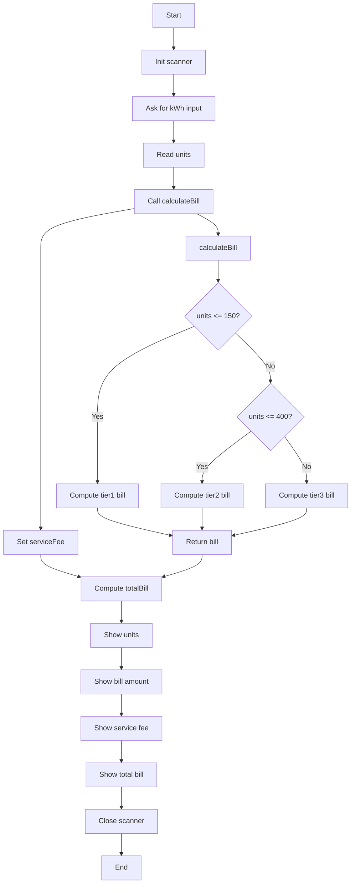

# Flowchart for ElectricityBillCalculator.java

## Program Flow

## Description

The program follows these steps:

1. **Input**: Gets electricity consumption in kWh from the user
2. **Processing**: Calculates the bill based on tiered pricing:
   - First 150 units: 3.50 THB/unit
   - Next 250 units (151-400): 4.20 THB/unit
   - Remaining units (401+): 5.00 THB/unit
3. **Service Fee**: Adds a fixed service fee of 50 THB
4. **Output**: Displays the units consumed, calculation breakdown, service fee, and total bill

## Decision Logic

The billing calculation uses a tiered approach:
- If units ≤ 150: All units charged at 3.50 THB/unit
- If 150 < units ≤ 400: First 150 units at 3.50 THB/unit, remaining at 4.20 THB/unit
- If units > 400: First 150 at 3.50 THB/unit, next 250 at 4.20 THB/unit, remainder at 5.00 THB/unit